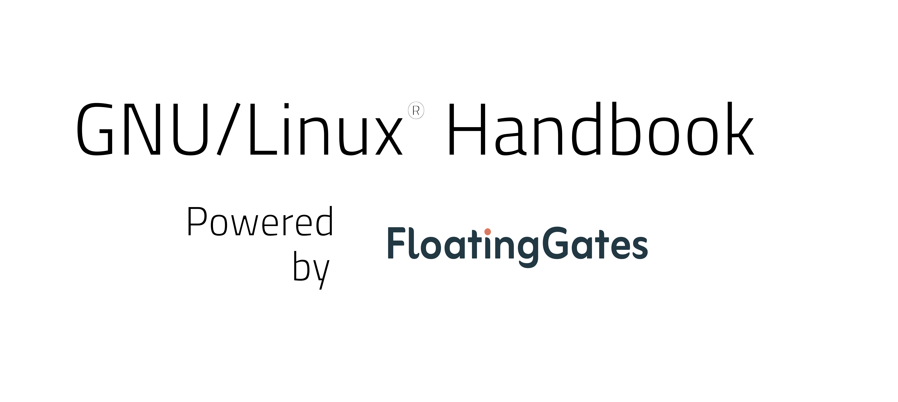

[](https://www.floating-gates.com/)

# Preface
-----------------------------------------------------------

This handbook contains documentation on using GNU/linux® systems, common workflows in scientific 
computing and few scripts to helps you during your day to day job. It is intended to support a 
medium-advanced  GNU/Linux® user during the usage of the software. Keep in mind it should be
seen as a co-pilot for your workflow, instead of a place to study on, it is designed to be
used via keywords search.

--------------------------------------------------------------


## How to interpret the text:

| Structure    | Meaning             |
| -----------  | ------------------- |
| Abc          | Normal text         |
|``` Abc```    | Shell command       |
|```<Abc>```   | User input required |
